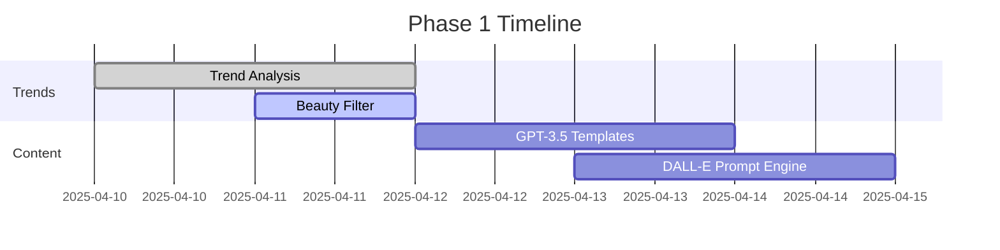

# Pinterest Affiliate Automation AI - Project Plan

## 📌 Core Objectives
- Automate beauty product discovery → content creation → Pinterest posting
- Max 5 posts/day ($0.20 DALL-E budget)
- 100% GPT-3.5 Turbo for text
- FTC-compliant disclosures

## 🛠️ Technical Stack
| Component | Technology | Cost Control |
|-----------|------------|--------------|
| Text Generation | GPT-3.5 Turbo | $0.002/1K tokens |
| Image Generation | DALL-E 3 | $0.04/image |
| Scheduling | Cursor AI Cron | Free |
| Storage | GitHub + Git LFS | Free |

## 📅 Phase Implementation

### Phase 1: Core Automation (Week 1)


### Phase 2: Compliance & Scaling (Week 2)
- FTC disclosure system
- Rate limit monitoring
- Multi-account support

## 🔐 Safety Protocols

### GitHub Protection Rules:
- Require PR reviews for main branch
- Block force pushes
- Status checks for pytest

### API Safeguards:
```python
# Auto-shutdown if exceeding budgets
if cost_tracker > daily_limit:
    system.send_alert()
    sys.exit(1)
```
