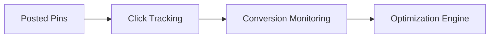

# Pinterest Affiliate Automation - Project Context

## 🔧 Technical Standards

### 🐍 Python Enforcement
```python
# Enforced via pre-commit hook
def validate_code():
    """Checks for compliance"""
    assert not uses_gpt4(), "Only GPT-3.5 Turbo allowed"
    assert file_size < 400, "Max 400 lines/file"
    assert has_type_hints(), "Type hints required"
```

### 📜 Content Creation Rules
| Component | Standard | Example |
|-----------|----------|---------|
| **Captions** | 180-220 chars | "Glowing skin starts with this serum! ✨ After 1 week, my dry patches improved. #SkincareRoutine" |
| **Images** | 1024x1024px | [DALL-E prompt template](#dalle-prompt-spec) |
| **Hashtags** | 3-5 per post | `#VitaminC #GlowBoost #AffiliateLink` |

## 🎯 Beauty Niche Specifications

### 💄 Sub-Niche Focus
```python
BEAUTY_CATEGORIES = {
    "skincare": {
        "keywords": ["serum", "moisturizer", "retinol"],
        "color_palette": "pastel pinks/whites",
        "props": "crystals, fresh flowers"
    },
    "haircare": {
        "keywords": ["mask", "repair", "curls"],
        "color_palette": "golden tones", 
        "props": "wooden brush, silk scarf"
    }
}
```

### ⚠️ Prohibited Claims
```text
- "Miracle cure" 
- "Instant results"
- "Dermatologist-recommended" (without proof)
- Before/after comparisons
```

## 🔐 Compliance Requirements

### 🔗 Affiliate Disclosure
```python
DISCLOSURE_TEXTS = {
    "minimal": "We earn commission from links.",
    "standard": "Disclosure: Purchases via our links may earn us a small commission.",
    "FTC": "Ad: We receive compensation for purchases made through this post."
}
```

### 🛡️ Safety Protocols
1. **API Failures**:
   ```python
   def handle_failure():
       log_error()
       store_for_retry()
       if consecutive_errors > 3:
           shutdown_system()
   ```

2. **Budget Limits**:
   ```python
   # Hard stops at:
   DALLE_DAILY_LIMIT = 0.20  # $0.04 x 5 posts
   GPT_MONTHLY_LIMIT = 5.00  # ~2500 generations
   ```

## 🖼️ DALL-E Prompt Spec
```python
PROMPT_TEMPLATE = """
Create Pinterest-optimized vertical image (2:3) showing {product} with:
- {color_palette} color scheme  
- {props} as decorative elements
- {lighting} lighting
- Minimalist composition
- Negative space for text overlay
- Photorealistic style

Product details: {product_details}
Avoid: {banned_elements}
"""
```

## 📊 Performance Tracking


## 🚨 Emergency Procedures

### Code Red Scenarios
1. **API Key Leak**:
   ```bash
   # Run immediately:
   python scripts/rotate_keys.py --emergency
   ```

2. **FTC Complaint**:
   - Halt all posting
   - Archive all content
   - Run compliance audit

## 🔄 Version History
- `2025-04-15`: Initial version
- `2025-04-16`: Added beauty niche specs
- `2025-04-17`: Integrated DALL-E guardrails

## 💡 Cursor AI Tips
1. **Quick Fixes**:
   - `Ctrl+K`: Generate compliant disclosure text
   - `Ctrl+L`: Explain complex API responses

2. **Debugging**:
   ```bash
   python -m pytest tests/ --cov=modules --cov-report=html
   ``` 