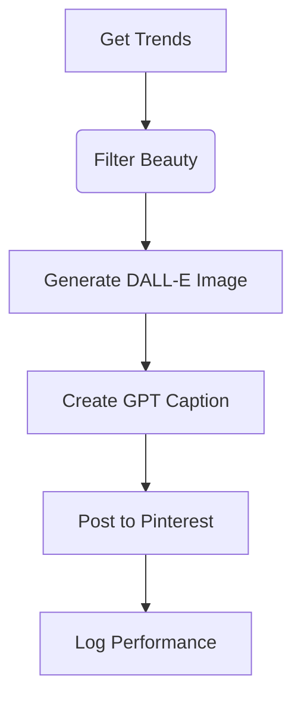

# Pinterest Affiliate Automation - Task Tracking

## 🔧 Current Sprint (Week of 2025-04-15)
### 🚀 High Priority (P0)
| Task | Technical Specs | Owner | Status |
|------|-----------------|-------|--------|
| **Beauty Trend Filter** | `modules/trends.py` - Filter for 50+ beauty keywords | @you | In Progress |
| **DALL-E Image Generator** | 1024x1024, natural style, $0.04/img budget | @you | Todo |
| **GPT-3.5 Caption Engine** | 200 token limit, FTC disclosure built-in | @you | Todo |
| **Pinterest API Connector** | Rate limited (5/min), auto-retry 3x | @you | Todo |

### 📈 Medium Priority (P1)
| Task | Technical Approach | Deadline |
|------|-------------------|----------|
| Affiliate Link Validator | Verify Amazon/CJ/ShareASale tags | 2025-04-18 |
| Performance Tracker | Log CTRs to CSV daily | 2025-04-19 |
| Hashtag Optimizer | GPT-3.5 generated + manual blacklist | 2025-04-20 |

## ✅ Completed Tasks
- [x] **Project Setup** (2025-04-10)
  - GitHub repo with MIT License
  - Cursor AI environment
  - API keys secured in `.env`
- [x] **Safety Protocols** (2025-04-11)
  - Budget tracking system
  - GPT-3.5 Turbo enforcement

## 🔄 Workflow


## ⚠️ Blockers & Risks
| Issue | Mitigation Plan |
|-------|-----------------|
| Pinterest API limits | Implement 5/min rate limiting |
| DALL-E cost overruns | Hard daily $0.20 cap |
| Affiliate link changes | Weekly validation script |

## 📅 Upcoming Milestones
1. **MVP Launch**: 2025-04-22
   - 5 posts/day automated
   - Basic reporting
2. **Phase 2**: 2025-05-01
   - Multi-account support
   - Instagram cross-posting

## 📌 Key Metrics
| Metric | Target | Current |
|--------|--------|---------|
| Daily Posts | 5 | 0 |
| Cost/Post | ≤$0.04 | - |
| CTR | ≥3% | - |
| API Success Rate | ≥99% | - |

## 🔧 Technical Debt
- [ ] Refactor trend filtering (Tech Debt TD-01)
- [ ] Improve error handling (Tech Debt TD-02)

## 💡 Pro Tips
1. Use Cursor's `Ctrl+K` for:
   - Generating API client boilerplate
   - Creating test cases
2. Debug with:
```bash
python -m pytest tests/ -v --cov=modules
```

## 📝 Change Log
- 2025-04-15: Created task file
- 2025-04-16: Added technical specs 